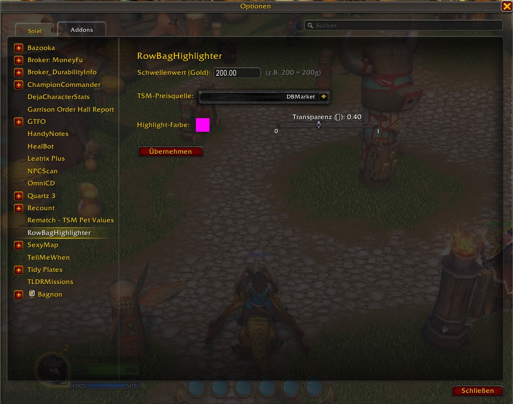
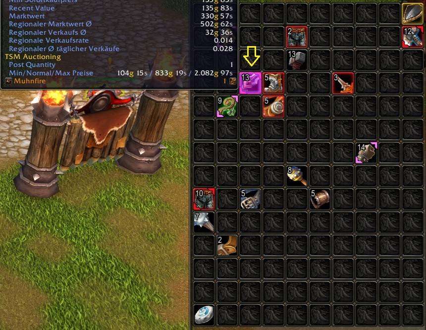

# RowBagHighlighter-WoW-Addon
RowBagHighlighter - Hebt Items in den Taschen hervor, basierend auf TSM-Preisen.  

## Changelog
- WoW Build 120000
  
Es lassen sich  
* Schwellenwert (Gold)  
* TSM-Preisquelle (z.B. DBMarket)  
* und die Highlight-Farbe und Transparenz
   
konfigurieren.  
 

   
  

SLASH-Befehle:  
* /rbh scan     - Cache leeren & Taschen neu scannen  
* /rbh config   - Einstellungen öffnen (Optionen > AddOns)
* /rbh debug    - Debug an/aus
